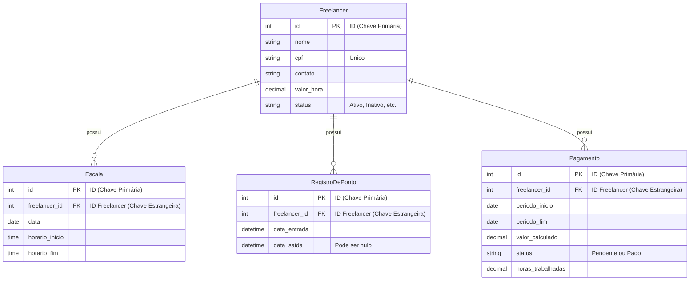

# Sistema de Gestão de Ponto para Freelancers

Projeto da disciplina **GAC116 - Programação Web (2025/2)** da Universidade Federal de Lavras - UFLA.

## 1. Descrição
Este projeto é um sistema web desenvolvido em Django, voltado para **restaurantes e lanchonetes** que precisam gerenciar a contratação e o pagamento de freelancers.

A aplicação permite:
- Cadastrar freelancers e seus dados (contato, valor/hora).
- Registrar entradas e saídas (bater o ponto) em tempo real.
- Criar e visualizar escalas/turnos de trabalho.
- Calcular e gerenciar o fechamento de horas e pagamentos.

## 2. Equipe
* Leandro Rodrigues de Paula Castro
* Maicon Maicon Querino Jesus de Souza
* Nicolas Mariano Lima

## 3. Tecnologias Utilizadas
O projeto foi construído com uma arquitetura monolítica, onde o Django gerencia tanto o back-end quanto o front-end (Templates).

| Categoria | Tecnologia |
| :--- | :--- |
| **Backend** | Django |
| **Frontend** | Django Templates + Bootstrap 5 |
| **Banco de Dados** | SQLite (Desenvolvimento) / PostgreSQL (Produção) |
| **Autenticação** | Sistema nativo do Django (`django.contrib.auth`) |
| **Controle de Versão** | Git + GitHub |

## 4. Funcionalidades Implementadas
O sistema é dividido em 4 módulos principais, todos protegidos por autenticação:

* **Dashboard:** Tela inicial com estatísticas rápidas sobre o sistema (total de freelancers, escalas para o dia, pagamentos pendentes, etc.).
* **Gestão de Freelancers:** CRUD completo para adicionar, listar, editar e visualizar freelancers.
* **Gestão de Escalas:** CRUD completo para agendar turnos para os freelancers, com visualização em lista.
* **Registro de Ponto:** Funcionalidade para que o gerente possa registrar a entrada e a saída de um freelancer, calculando a duração do turno.
* **Gestão de Pagamentos:** CRUD para criar registros de pagamento, calcular o valor devido com base nas horas e marcar como "Pago" ou "Pendente".
* **Django Admin:** O ambiente administrativo (`/admin/`) foi configurado para permitir a gestão completa de todos os models.

## 5. Como Rodar o Projeto

Siga os passos abaixo para executar o projeto localmente.

**1. Clonar o Repositório:**
```bash
git clone <URL_DO_SEU_REPOSITORIO>
cd gestao_freelancers
````

**2. Criar e Ativar o Ambiente Virtual (venv):**

```bash
# Windows
python -m venv venv
.\venv\Scripts\activate

# macOS / Linux
python3 -m venv venv
source venv/bin/activate
```

**3. Instalar as Dependências:**
*(É uma boa prática criar um arquivo `requirements.txt` com `pip freeze > requirements.txt`. Por enquanto, instalaremos o Django)*

```bash
pip install django
```

**4. Aplicar as Migrações (Criar o Banco de Dados):**
Isso criará o arquivo `db.sqlite3` e todas as tabelas.

```bash
python manage.py migrate
```

**5. Criar um Superusuário (Administrador):**
Você precisará deste usuário para acessar o sistema e o `/admin/`.

```bash
python manage.py createsuperuser
```

*(Siga os passos para definir username, email e senha)*

**6. Rodar o Servidor:**

```bash
python manage.py runserver
```

**7. Acessar o Sistema:**

  - **Login:** [http://127.0.0.1:8000/login/](https://www.google.com/search?q=http://127.0.0.1:8000/login/)
  - **Dashboard (App):** [http://127.0.0.1:8000/](https://www.google.com/search?q=http://127.0.0.1:8000/)
  - **Admin (Django):** [http://127.0.0.1:8000/admin/](https://www.google.com/search?q=http://127.0.0.1:8000/admin/)

## 6\. Modelo do Banco de Dados (ER)

O diagrama abaixo mostra como as entidades principais do sistema se relacionam.



## 7\. Checkpoints da Disciplina

  - **Checkpoint 1 (23/10):** Modelagem completa, Django Admin funcional e autenticação.
  - **Checkpoint 2 (06/11):** Entrega final do sistema completo.

